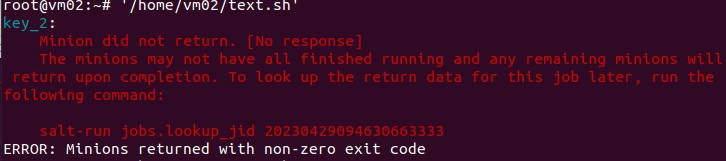

# Подготовка стенда

**1. Была установлена ОС Astra Linux. Системе было присвоено имя «VM01». Далее были произведены настройки сети: осуществление подключения к внешней сети через соединение с NAT.**

1. Bash-скрипт:
```bash
sudo su              # Получение прав администратора
nm-connection-editor # Открытие настроек сетевого подключения
```
2. В настройках сетевого подключения было добавлено новое подключение: «Соединение типа «Ethernet»».



Далее соединение было создано и ему было присвоено имя «mainLock». Метод соединения изменён.


Соединение на VM01 было изменено с «Соединение по умолчанию» на «mainLock».


**2. Далее была успешно развёрнута вторая виртуальная машина, с отличным IP-адресом.**

